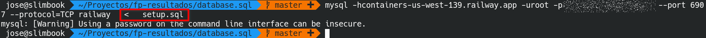

# FP Resultados


## Repositorios relacionados
- [App para android](https://github.com/jamj2000/fp-resultados.apk)
- [Capturas](https://github.com/jamj2000/fp-resultados.capturas)


## Introducción
__fp-resultados__ es una aplicación web destinada al profesorado de Formación Profesional en España. Realizada en mi tiempo libre para seguir aprendiendo sobre distintas tecnologías web. La pongo a disposición de toda la comunidad por si alguien la considera interesante por motivos didácticos o de producción.


Existe una aplicación funcional alojada en [railway.app](https://fp-resultados-production.up.railway.app/) para fines demostrativos. En esta plataforma tengo el plan gratuito, que tiene un límite de horas. Si no te carga la página, probablemente haya agotado el límite de horas mensual. Deberás esperar al siguiente mes para acceder a la aplicación. Sorry 😞  


La aplicación es funcional y dispone de numerosas características.


### Características
- Permite calificar por resultados de aprendizaje.
- Genera actas de evaluación y boletines de calificaciones en HTML y PDF. (Informes PDF aún no terminado)
- Se ha diseñado pensando en los ciclos formativos de la familia profesional de Informática y Comunicaciones, sin embargo es posible adaptarla a otras familias profesionales.
- Permite las operaciones CRUD (Create, Read, Update, Delete) a base de datos MySQL a través de interfaz web.


### Probar la aplicación de demostración
Si deseas comprobar las funcionalidades que ofrece esta aplicación, puedes hacerlo en [railway.app](https://fp-resultados-production.up.railway.app)


Para entrar debes introducir un correo y contraseña.
Puedes utilizar cualquiera de los siguientes (correos ficticios):

```
email                  contraseña  
=================================
profe1@gmail.com       profe1
profe2@gmail.com       profe2
profe3@gmail.com       profe3
profe4@gmail.com       profe4
profe5@gmail.com       profe5
profe6@gmail.com       profe6
profe7@gmail.com       profe7
profe8@gmail.com       profe8
profe9@gmail.com       profe9
```
Cada proferor puede calificar los resultados de aprendizaje de los módulos que imparte.
Algunos de ellos son tutores de algún curso, otros no. Los que son tutores pueden ver y generar los boletines de notas de su tutoría. Existe un administrador (yo, con correo real jamj2000@gmail.com) que puede ver y generar las actas de evaluación así como realizar diversas tareas administrativas.

Si deseas comprobar las posibilidades para el/los usuarios administradores deberás instalarte la aplicación en tu equipo local y probarla ahí.


## Despliegue en Docker

También puedes desplegar la aplicación con Docker. Existe una imagen para la aplicación web y otra para la base de datos.

Para descargar las imágenes y lanzar los contenedores, ejecuta:


```shell
# Descargamos código fuente de la aplicación
git  clone  https://github.com/jamj2000/fp-resultados.git

# Entramos en carpeta de código fuente
cd fp-resultados

# Lanzamos contenedores
docker-compose  up  -d
```

Para acceder a la aplicación, abre con el navegador la URL [localhost:8888](http://localhost:8888).

El contenedor de MariaDB lleva asociado un **volumen** para guardar la información de la BD y ofrecer persistencia de datos entre distintas ejecuciones. 

En cualquier momento podemos realizar una copia de seguridad del volumen con el contenido de la BD, con el comando:

**Exportar volumen fp_datos** 


```bash
docker run --rm -v fp_datos:/source:ro \
  busybox tar -czC /source . > fp_datos.tar.gz
```

Y obtendremos una copia de seguridad del volumen en el archivo `fp_datos.tar.gz`.

Para restaurar la copia de seguridad anterior de dicho volumen ejecutamos el siguiente comando:

**Importar volumen fp_datos**

```bash
docker run --rm -i -v fp_datos:/target \
  busybox tar -xzC /target < fp_datos.tar.gz
```

> NOTA: 
>Antes de restaurar la copia de seguridad deberemos asegurarnos de que la aplicación está detenida y el volumen no existe. Esto puede hacerse con los comandos:
>
> ```bash
> docker-compose  down
> docker  volume  rm  fp_datos
> ```
> Después restauramos el volumen según se indica más arriba y por último iniciamos la aplicación con `docker-compose up -d`.


## Despliegue en Heroku + GearHost


> Actualmente, tanto Heroku como GearHost son de pago. Por tanto, si deseas hacer uso de las indicaciones siguientes, es posible que haya habido algún pequeño cambio en la forma de trabajar con estas plataformas. Tenlo en cuenta.
>
> Se ha dejado visible, por motivos didácticos y como registro de un pasado menos convulso 😛 

La aplicación estaba desplegada en [HEROKU](https://www.heroku.com). Como base de datos utiliza DBaaS MySQL proporcionado por [GEARHOST](https://gearhost.com).

Si deseas hacer un despligue usando los servicios proporcionados por los sitios anteriores, **sigue estos pasos**: 

**1. Crea una cuenta en Heroku.** Éste tiene varios [planes](https://www.heroku.com/pricing). Registrate en el plan Free, que aunque está algo limitado es gratis.

**2. Instala la herramienta `heroku-cli`.** En [este enlace](https://devcenter.heroku.com/articles/heroku-cli) tienes la información necesaria.

**3. Clona este repositorio en tu equipo:**
  ```bash
  git  clone  https://github.com/jamj2000/fp-resultados.git
  cd   fp-resultados
  ```

**4. Inicia sesión desde el terminal en la cuenta que previamente creaste en Heroku.** Y crea una nueva aplicación. Lo haremos desde CLI (Command Line Interface).
  
  Para iniciar sesión en Heroku 
  ```bash
  heroku login  -i
  ```
 
  Para crear una aplicación:
  ```bash
  heroku apps:create  --region eu  nombre_aplicacion
  ```
  
  Podemos ver las aplicaciones creadas con:
  ```bash
  heroku apps
  ```

  > NOTA: Si deseamos eliminar una aplicación, podemos hacerlo con:
  > ```bash
  > heroku apps:destroy  nombre_aplicacion --confirm nombre_aplicacion
  > ```

  Comprobamos que tenemos asociado el repositorio Git remoto de Heroku:
  ```bash
  git remote -v
  ```

  Si no es así, añadimos el repositorio git que proporciona Heroku.
  ```bash
  git  remote  add  heroku  https://git.heroku.com/nombre_aplicacion.git
  ```
  
  **NOTA:** Debes sustituir `nombre_aplicacion` por el nombre que desees dar a tu aplicación. Ten en cuenta que no puede tener espacios en blanco ni tildes. Probablemente tengas que probar con varios nombres, pues muchos de ellos ya están ocupados. La opción `--region eu` es para que la aplicación se aloje en servidores de Europa. 
  
**5. Despliega el código en Heroku.**
  
  ```bash
  git  push  heroku  master
  ```

  Dentro de unos instantes podrás acceder a la aplicación en la url `http://nombre_aplicacion.herokuapp.com`. 
  
  **NOTA:** Debes sustituir `nombre_aplicacion` por el nombre de tu aplicación.
  
  Puedes verla abriendo dicha url en el navegador o ejecutando
  
  ```bash
  heroku  open
  ```


**6. ¿Y los datos?**
  
  Los datos de la aplicación se guardan en una base de datos. En este caso hemos usado el DBaaS que nos proporciona [GearHost](https://www.gearhost.com). Este sitio tiene varios [planes](https://www.gearhost.com/pricing). Escoge el plan Free, que aunque está algo limitado **era** gratis, **ya no existe este plan**. 

**7. Crea una base de datos MySQL y apunta los parámetros de configuración.**
  
  En concreto deberás anotar 5 datos:
  - El nombre o IP de host donde se aloja la base de datos.
  - El puerto.
  - El nombre de la base de datos.
  - El nombre del usuario.
  - La contraseña de dicho usuario.
  
  

**8. Crea las tablas e introduce los datos en ellas. Para ello sigue estos pasos:**

  - Entra en el directorio data del repositorio, que contiene los datos y el script `database.sh` a ejecutar.

  ```bash
  cd  database.sql
  ```
  - Edita el script `database.sh` con la información de tu base de datos.
  
  
  
  - Ejecuta el script `database.sh`
 
  
  
  - Comprueba que el resultado es correcto.
  
  ```bash
  mysql -h database_host -D database_name -u database_user -pdatabase_password
  ```
  **NOTA**: Sustituye *database_host*,  *database_name*,  *database_user* y *database_password* por los valores que aparecen en tu configuración de GearHost.
  
  
   

**9. Asegúrate que el archivo `config/database.php` contiene, entre otras, la siguiente configuración:**

  ```php

    'default' => env('DB_CONNECTION', 'mysql'),

    // ...

        'mysql' => [
            'driver' => 'mysql',
            'url' => env('DATABASE_URL'),
            'host' => env('DB_HOST', '127.0.0.1'),
            'port' => env('DB_PORT', '3306'),
            'database' => env('DB_DATABASE', 'forge'),
            'username' => env('DB_USERNAME', 'forge'),
            'password' => env('DB_PASSWORD', ''),
            'unix_socket' => env('DB_SOCKET', ''),
            'charset' => 'utf8mb4',
  ```
  
  En el paso siguiente vamos a configurar las **variables de entorno** necesarias para la conexión a la base de datos.
  

10. Configura las **variables de entorno** (llamadas config var en Heroku).

Para ello puedes usar uno de los siguientes métodos:
- Interfaz de Línea de Comandos (CLI) 
- Interfaz Web

**CLI**

Debemos asignar valores a las 6 variables siguientes: `DB_HOST`, `DB_PORT`, `DB_DATABASE`, `DB_USERNAME` y `DB_PASSWORD`.

Por ejemplo:

```bash
heroku config:set DB_HOST=den...gear.host
heroku config:set DB_PORT=3306
heroku config:set DB_DATABASE=basedatos
heroku config:set DB_USERNAME=usuario
heroku config:set DB_PASSWORD=clave
```

Para ver las variables configuradas, ejecutamos:

```bash
heroku config
```


> NOTA: Si deseamos eliminar una variable, lo hacemos con
>
> ```bash
> heroku config:unset NOMBRE_VARIABLE
> ```


**Interfaz Web**

Si configurar las variables de entorno mediante CLI no te llama la atención, siempre puedes hacerlo mediante intefaz Web. 

Para ello, vuelve a la web de Heroku, inicia sesión, selecciona tu aplicación y pincha en el apartado `Settings` y luego en el botón `Reveal Config Vars`. Crea las variables de entorno que se muestran a continuación con los datos que recopilaste en el apartado anterior. Después pulsa en el boton `More` y luego en `Restart all dynos`, en la parte superior derecha de la página.

  
  

**11. Inicia el navegador web y abre la URL de la aplicación.** En mi caso `http://fp-resultados.herokuapp.com`.

  Debe aparecer lo siguiente:
  

  Si inicias sesión con usuario `profe9@gmail.com` y contraseña `profe9`:  
  
  


## Despliegue en Railway

Después de que Heroku pasase a ser de pago, estuve investigando un poco acerca de [plataformas gratuitas donde desplegar esta aplicación](https://github.com/jamj2000/deploy). En un principio me he decantado por **railway.app**, puesto que permite subir proyectos PHP y también dispone de provisión de base de datos MySQL.

Si deseas desplegar tú mismo esta aplicación en esta plataforma, **sigue los siguientes pasos**:

**1. Regístrate en el sitio y accede a tu dashboard.**

A continuación muestro mi dashboard después de crear los dos proyectos que necesitarás: 


2. Pulsa en el botón **New Project**. 


**3. Crea una aplicación con código fuente desde un repositorio de GitHub.**


> NOTA: Antes de poder seleccionar un repositorio, deberás realizar la configuración de acceso a GitHub. Si no dispones del código fuente de la aplicación, **haz un fork** de [https://github.com/jamj2000/fp-resultados](https://github.com/jamj2000/fp-resultados).

Por ahora no haremos nada más. Más adelante volveremos a la aplicación para terminar de configurarla. 
A continuación pasamos a provisionar la base de datos.


**4. Clonamos el repositorio para tener acceso de forma local al código fuente.**

```console
git  clone  https://github.com/jamj2000/fp-resultados
cd   fp-resultados
```

> NOTA: Es aconsejable que utilices tu repositorio *forkeado*, así podrás modificar el proyecto a tu gusto.


**5. Crea una provisión MySQL.**

      

Comprueba los datos de conexión:

  

Para insertar los datos de las tablas, ejecutamos el script **setup.sql** que se halla dentro de la carpeta `database.sql` desde un terminal de texto.
Puedes ver el contenido de este archivo [aquí](https://github.com/jamj2000/fp-resultados/blob/master/database.sql/setup.sql)

Entramos en la carpeta

```console 
cd  database.sql
```

Y ejecutamos

 

Si todo ha ido bien podrás ver los datos en la pestaña **Data**

  

Por último, comprueba las **variables de entorno**

  

Copia estas variables. Las necesitarás para configurar la aplicación.


**6. Finalizamos la configuración de la aplicación.**

Vuelve a la aplicación. Y crea las **variables de entorno** anteriores, pero con el nombre que aparece más abajo. Esto es necesario porque en el archivo `config/database.php` de la aplicación tenemos los siguientes nombres de variables:

  ```php

    'default' => env('DB_CONNECTION', 'mysql'),

    // ...

        'mysql' => [
            'driver' => 'mysql',
            'url' => env('DATABASE_URL'),
            'host' => env('DB_HOST', '127.0.0.1'),
            'port' => env('DB_PORT', '3306'),
            'database' => env('DB_DATABASE', 'forge'),
            'username' => env('DB_USERNAME', 'forge'),
            'password' => env('DB_PASSWORD', ''),
            'unix_socket' => env('DB_SOCKET', ''),
            'charset' => 'utf8mb4',
  ```

  

Por último, en la pestaña de **Deployments** -> **Details**, deberás indicar que el despliegue se hará mediante un **dockerfile** y que el comando a ejecutar al iniciar el contenedor será `/var/www/html/deploy.sh`. Puedes ver el contenido de este archivo [aquí](https://github.com/jamj2000/fp-resultados/blob/master/deploy.sh)


  


# Licencia

* [GPL-3](http://www.gnu.org/licenses/gpl-3.0.html) / <https://github.com/jamj2000/fp-resultados>
* [CC BY-SA 4.0](https://creativecommons.org/licenses/by-sa/4.0/) / <https://github.com/alecive/FlatWoken>

```
- Código            GPL-3         José Antonio Muñoz Jiménez
- Iconos FlatWoken  CC BY-SA 4.0  Alessandro Roncone         
```

