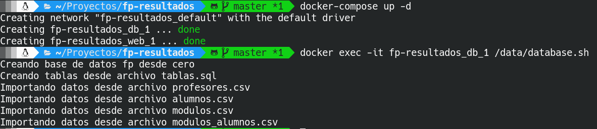

# fp-resultados


## Repositorios relacionados
- [App para android](https://github.com/jamj2000/fp-resultados.apk)
- [Datos de ejemplo](https://github.com/jamj2000/fp-resultados.datos)
- [Capturas](https://github.com/jamj2000/fp-resultados.capturas)


## Introducción
__fp-resultados__ es una aplicación web destinada al profesorado de Formación Profesional en España. Realizada en mi tiempo libre para seguir aprendiendo sobre distintas tecnologías web. La pongo a disposición de toda la comunidad por si alguien la considera interesante por motivos didácticos o de producción.


Existe una aplicación funcional alojada en [heroku.com](http://fp-resultados.herokuapp.com) para fines demostrativos. La primera vez que se accede a ella suele tardar algún tiempo en cargar. Si esto ocurre volver a intentar de nuevo. 


La aplicación es funcional y dispone de numerosas características.


### Características
- Permite calificar por resultados de aprendizaje.
- Genera actas de evaluación y boletines de calificaciones en HTML y PDF.
- Se ha diseñado pensando en los ciclos formativos de la familia profesional de Informática y Comunicaciones, sin embargo es posible adaptarla a otras familias profesionales.
- Permite las operaciones CRUD (Create, Read, Update, Delete) a base de datos MySQL a través de interfaz web.


### Probar la aplicación de demostración
Si deseas comprobar las funcionalidades que ofrece esta aplicación, abre en el navegador la dirección [http://fp-resultados.herokuapp.com](http://fp-resultados.herokuapp.com).

Para entrar debes introducir un correo y contraseña.
Puedes utilizar cualquiera de los siguientes (correos ficticios):

```
email                  contraseña  
=================================
profe1@gmail.com       profe1
profe2@gmail.com       profe2
profe3@gmail.com       profe3
profe4@gmail.com       profe4
profe5@gmail.com       profe5
profe6@gmail.com       profe6
profe7@gmail.com       profe7
profe8@gmail.com       profe8
profe9@gmail.com       profe9
```
Cada proferor puede calificar los resultados de aprendizaje de los módulos que imparte.
Algunos de ellos son tutores de algún curso, otros no. Los que son tutores pueden ver y generar los boletines de notas de su tutoría. Existe un administrador (yo, con correo real jamj2000@gmail.com) que puede ver y generar las actas de evaluación así como realizar diversas tareas administrativas.

Si deseas comprobar las posibilidades para el/los usuarios administradores deberás instalarte la aplicación en tu equipo local y probarla ahí.


## Despliegue en equipo local

Este proyecto se desarrolló durante el año 2015, por lo tanto tiene ya algunos años. Es un proyecto realizado en **PHP** con el **Framework Laravel 4.2**. Debido a esto es requisito usar la versión **PHP5** en lugar de la versión PHP 7 actual. La mayoría de las distribuciones modernas ya vienen con PHP 7. Así que si deseamos instalar la versión 5 deberemos añadir los repositorios adecuados. 

Si estás interesado en probar la aplicación en tu equipo local, aquí tienes los pasos a seguir para PC con distro Ubuntu o similar:

0) Prerrequisito de PHP 5.

Para instalar la versión 5 de PHP, debemos añadir los repositorios adecuados. Por ejemplo, para Ubuntu 18.04 hacemos:

```bash
sudo add-apt-repository -y ppa:ondrej/php
sudo apt update
```

1) Instala los paquetes necesarios para tener un servidor Apache+PHP+MySQL

```bash
sudo apt-get install apache2 mysql-server php5.6 php5.6-mysql php5.6-mcrypt mcrypt curl git
```

**NOTA:** De aquí en adelante, por simplicidad, no repetiré en cada comando la orden `sudo`. Sin embargo **todas los pasos y operaciones realizadas a continuación deben realizarse con perfil de superusuario**. 


2) Configura el archivo /etc/apache2/apache2.conf, para que aparezca

```apache
<Directory /var/www/>
  Options Indexes FollowSymLinks
  AllowOverride All
  Require all granted
</Directory>
```
 
3) Activa módulos de Apache y reinicia servidor

```bash
a2enmod rewrite
phpenmod mcrypt
systemctl restart apache2
``` 
 
4) Descarga código del repositorio [fp-resultados](https://github.com/jamj2000/fp-resultados)

```bash
cd /var/www/html
git clone https://github.com/jamj2000/fp-resultados.git
```

5) Entra en el directorio donde se ha descargado el código y da permisos de escritura al subdirectorio app/storage

```bash
cd /var/www/html/fp-resultados
chmod -R 777 app/storage
```

6) Instala el software `composer`.

```bash
curl -sS  https://getcomposer.org/installer | php
mv composer.phar /usr/local/bin/composer
```

7) Instala las dependencias necesarias 

```bash
cd /var/www/html/fp-resultados
composer install
```

Esto nos permite comprobar las dependencias especificadas en el archivo `composer.json` e instalar los paquetes enumerados en ese archivo, recreando el entorno que se estaba utilizando por última vez.

Si todo ha ido bien, se creará una carpeta llamada `vendor` con todos los paquetes que necesita la aplicación como dependencias.

8) Prueba en el navegador [http://localhost/fp-resultados/public](http://localhost/fp-resultados/public)

9) Descarga datos de ejemplo del repositorio [fp-resultados.datos](https://github.com/jamj2000/fp-resultados.datos)

```bash
cd /var/www/html
git clone https://github.com/jamj2000/fp-resultados.datos.git
```

10) Revisa el script ```database.sh``` para modificar tu usuario y clave de mysql

```bash
cd /var/www/html/fp-resultados.datos
nano database.sh
```
11) Ejecuta el script ```database.sh```

```bash
chmod +x database.sh
./database.sh
```

12) Recuerda que los valores previos también deben hallarse en el archivo ```/var/www/html/fp-resultados/app/config/local/database.php```. Por ejemplo para usuario root y clave root. Modifica los valores según hayas hecho en ```database.sh```.

```php
               'mysql' => array(
                        'driver'    => 'mysql',
                        'host'      => 'localhost',
                        'port'      => '3306',
                        'database'  => 'fp',
                        'username'  => 'root',
                        'password'  => 'root',
                        'charset'   => 'utf8',
                        'charset'   => 'utf8',
                        'collation' => 'utf8_unicode_ci',
                        'prefix'    => '',
                ),

```

13) Si necesitas establecer o cambiar una clave en MySQL, puedes hacerlo con el comando de mysql:

**`ALTER USER '`usuario`'@'localhost' IDENTIFIED WITH mysql_native_password BY '`clave`';`**

En las últimas versiones el sistema de autenticación ha sido cambiado de forma significativa respecto a versiones anteriores. Si instalas la version 5.7 o superior de mysql, usará el plugin auth_socket y no proporcionará una contraseña al usuario root. Pero nosotros queremos ponerle una contraseña.

**Para ello necesitamos cambiar el plugin y establecer la contraseña al mismo tiempo, en el mismo comando**. Primero, cambiar el plugin y luego configurar la contraseña no funcionará, y volverá a caer en auth_socket.


Por ejemplo para el usuario root hacemos:
```
sudo mysql -u root

mysql> ALTER USER 'root'@'localhost' IDENTIFIED WITH mysql_native_password BY 'root';
mysql> FLUSH PRIVILEGES;

mysql> SELECT User, Host, plugin FROM mysql.user;
+------------------+-----------+-----------------------+
| User             | Host      | plugin                |
+------------------+-----------+-----------------------+
| root             | localhost | mysql_native_password |
| mysql.session    | localhost | mysql_native_password |
| mysql.sys        | localhost | mysql_native_password |
| debian-sys-maint | localhost | mysql_native_password |
| jose             | localhost | auth_socket           |
+------------------+-----------+-----------------------+
5 rows in set (0.00 sec)

mysql> SELECT User, Host, authentication_string FROM mysql.user;
+------------------+-----------+-------------------------------------------+
| User             | Host      | authentication_string                     |
+------------------+-----------+-------------------------------------------+
| root             | localhost | *81F5E21E35407D884A6CD4A731AEBFB6AF209E1B |
| mysql.session    | localhost | *THISISNOTAVALIDPASSWORDTHATCANBEUSEDHERE |
| mysql.sys        | localhost | *THISISNOTAVALIDPASSWORDTHATCANBEUSEDHERE |
| debian-sys-maint | localhost | *B117D4112EFD856563A869CC76ABE86FCA0735C2 |
| jose             | localhost | *9B7E9CB5C7418FF658BE5C710AC2A3688DFAABF8 |
+------------------+-----------+-------------------------------------------+
5 rows in set (0.00 sec)

mysql> exit;

systemctl restart mysql
```

Si el usuario no existe, utilizar `CREATE` en lugar de `ALTER`.

> REFERENCIA: He dado con la solución al problema anterior en el siguiente enlace, después de haber visitado media internet:
>
> - https://www.percona.com/blog/2016/03/16/change-user-password-in-mysql-5-7-with-plugin-auth_socket/


> NOTA: En algunos casos está habilitada una **política de contraseñas** bastante estricta, del tipo: introducir al menos 8 caracteres, minúsculas y mayúsculas, dígitos y caracteres no alfanuméricos. Podemos deshabilitarla con:
>
>```
>mysql> uninstall plugin validate_password;
>```


## Despliegue en Docker

También puedes desplegar la aplicación con Docker. Existe una imagen para la aplicación web y otra para la base de datos.

Para descargar las imágenes y lanzar los contenedores, ejecuta:


```
git  clone  https://github.com/jamj2000/fp-resultados.git

cd fp-resultados.git

docker-compose  up  -d
```

Para insertar los datos en el volumen asociado a MySQL ejecuta:

```
docker  exec  fpresultados_bd_1  /data/database.sh
```



Para ejecutar la aplicación, abre con el navegador la URL `http://localhost:8888`.

Como puedes observar en la imagen anterior, el contenedor de MySQL lleva asociado un **volumen** para guardar la información de la BD y ofrecer persistencia de datos entre distintas ejecuciones. 

En cualquier momento podemos realizar una copia de seguridad del volumen con el contenido de la BD, con el comando:

**Exportar volumen fpresultados_datos** 


```bash
docker run --rm \
  -v fpresultados_datos:/source:ro \
  busybox tar -czC /source . > fpresultados_datos.tar.gz
```

Y obtendremos una copia de seguridad del volumen en el archivo `fpresultados_datos.tar.gz`.

Para restaurar la copia de seguridad anterior de dicho volumen ejecutamos el siguiente comando:

**Importar volumen fpresultados_datos**

```bash
docker run --rm -i \
  -v fpresultados_datos:/target \
  busybox tar -xzC /target < fpresultados_datos.tar.gz
```

> NOTA: 
>Antes de restaurar la copia de seguridad deberemos asegurarnos de que la aplicación está detenida y el volumen no existe. Esto puede hacerse con los comandos:
>
> ```bash
> docker-compose  down
> docker  volume  rm  fpresultados_datos
> ```
> Después restauramos el volumen según se indica más arriba y por último iniciamos la aplicación con `docker-compose up -d`.


## Despliegue en Heroku + GearHost (y algo de Docker)

> **NOTA IMPORTANTE:**
>
> Esta aplicación y sus dependencias hacen uso de PHP 5. Puesto que actualmente se usa la versión PHP 7 en Ubuntu 18.04+, el código fuente aquí disponible se considera código *legacy*.
>
> Esto provoca que su despliegue en un entorno de desarrollo local necesite de Ubuntu 16.04 con PHP 5. Instalar una máquina con dicho entorno es algo engorroso. Por tanto, usaremos Docker para obtener un entorno de desarrollo con PHP 5.
>
> Usaremos este [Dockerfile](Dockerfile). A partir de él generaremos una imagen Docker y luego lanzaremos un contenedor basado en dicha imagen.
>


Actualmente la aplicación está desplegada en [HEROKU](https://www.heroku.com). Como base de datos utiliza DBaaS MySQL proporcionado por [GEARHOST](https://gearhost.com).

Si deseas hacer un despligue usando los servicios proporcionados por los sitios anteriores, sigue estos pasos: 

1. Create una cuenta en Heroku. Éste tiene varios [planes](https://www.heroku.com/pricing). Registrate en el plan Free, que aunque está algo limitado es gratis.

2. Instala la herramienta `heroku-cli`. En [este enlace](https://devcenter.heroku.com/articles/heroku-cli) tienes la información necesaria.

3. Clona este repositorio en tu equipo:
  ```bash
  git  clone  https://github.com/jamj2000/fp-resultados.git
  cd   fp-resultados
  ```

4. Genera una imagen Docker a partir de **Dockerfile**

El contenido del archivo **`Dockerfile`** es el siguiente:

```
FROM php:5.6-apache

WORKDIR /var/www/html
COPY . .

RUN sed -i 's!/var/www/html!/var/www/html/public!g' /etc/apache2/sites-available/000-default.conf \
 && curl -S https://getcomposer.org/installer | php -- --install-dir=/usr/local/bin --filename=composer \
 && apt-get update && apt-get install -y unzip git libmcrypt-dev \
 && docker-php-ext-install pdo pdo_mysql mcrypt \
 && docker-php-ext-enable mcrypt \
 && a2enmod rewrite

RUN composer install \ 
 && chown -R www-data:www-data .  && chmod -R 777 app/storage \
 && composer update
```

Esto nos permitirá crear una imagen Docker:

- con PHP 5.6 y Apache
- con el directorio de trabajo `/var/www/html` dentro del contenedor
- con una copia de todo nuestro código fuente en el directorio anterior
- con la instalación de composer y otros paquetes necesarios
- con un archivo `composer.lock` generado mediante `composer update`

Para crear una imagen llamada `fp-resultados`, ejecutamos:

```bash
docker  build  -t fp-resultados  .
```

La opción `-t  fp-resultados` permite asignar un nombre a la imagen Docker.

El punto final indica que docker debe buscar el archivo `Dockerfile` en el directorio actual.

Para comprobar que se ha creado bien la imagen anterior, ejecutamos:

```bash
docker images
```

5. Lanza un contenedor que haga uso de la imagen anterior.

```bash
  docker  run  -d \
               -p 8888:80 \
               --mount source=fp-volume,target=/var/www/html \
               --name fp-app \
               fp-resultados
```
El nombre del contenedor será `fp-app` y la imagen usada será `fp-resultados`.

Mapeamos el puerto 8888 al puerto 80 del contenedor. Por tanto, podemos ver la aplicación funcionando en `http://localhost:8888`.

El contenido del directorio `/var/www/html` del contenedor será accesible en el anfitrión como volumen llamado `fp-volume`. Esto nos permite acceder al código fuente de la aplicación. Este código aparece en `/var/lib/docker/volumes/fp-volume/_data`. Al tratarse de un directorio del sistema, deberemos acceder a él con permisos de root.

Por tanto, ejecuta:

```bash
sudo su
cd  /var/lib/docker/volumes/fp-volume/_data
ls
```


Observa que aparecen un archivo `composer.lock` y una carpeta `vendor` que no estaban en el código fuente original.

El archivo `composer.lock` especifica las versiones concretas para cada una de las dependencias.

La carpeta `vendor` contiene cada una de las dependencias de la aplicación. Esta carpeta no se sube al repositorio git. Por tanto, cuando subamos el código fuente a Heroku, éste leerá el archivo `composer.lock` y volverá a obtener las dependencias, guardándolas en la carpeta `vendor` remota.

6. Inicia sesión desde el terminal en la cuenta que previamente creaste en Heroku. Y crea una nueva aplicación. 
  
  ```bash
  heroku login  --interactive
  heroku create --region eu  nombre_aplicacion
  ```
  
  Añadimos el `repositorio git` que proporciona Heroku.
  ```bash
  git  remote  add  heroku  https://git.heroku.com/nombre_aplicacion.git
  ```
  
  **NOTA:** Debes sustituir `nombre_aplicacion` por el nombre que desees dar a tu aplicación. Ten en cuenta que no puede tener espacios en blanco ni tildes. Probablemente tengas que probar con varios nombres, pues muchos de ellos ya están ocupados. La opción `--region eu` es para que la aplicación se aloje en servidores de Europa. 
  
 

7. Las últimas versiones de Heroku realizan el despliegue sobre un *stack* Ubuntu 18, el cual viene con PHP7. Por tanto no es válido para nuestro despliegue. Deberemos indicar que deseamos desplegar sobre el *stack* Ubuntu 16, que viene con PHP 5.

Podemos ver los stacks disponibles con la sentencia:

```bash
heroku  stack
```

Para establecer el **stack heroku-16**, que es el que nos proporciona una base Ubuntu 16 + PHP5, ejecutamos:

```bash
heroku  stack:set  heroku-16
```

7. Despliega el código en Heroku.
  
  ```bash
  git  add .
  git  commit  -m "Añadido composer.lock`
  git  push  heroku  master
  ```

> **NOTA:**
>
> Puesto que estás como usuario `root` (previamente hiciste `sudo su`), es muy problable que se te pida que introduzcas tus credenciales de git.
> 
> ```
> git config --global user.name "Nombre Apellidos"
> git config --global user.email nombre@example.com
> ```


  Dentro de unos instantes podrás acceder a la aplicación en la url `http://nombre_aplicacion.herokuapp.com`. 
  
  **NOTA:** Debes sustituir `nombre_aplicacion` por el nombre de tu aplicación.
  
  Puedes verla abriendo dicha url en el navegador o ejecutando
  
  ```bash
  heroku  open
  ```
  
> **NOTA:**
> 
> Una vez desplegada la aplicación, podemos eliminar el contenedor y el volumen asociado.
>
> Para ello, vuelve a tu usuario normal ejecutando `exit`.
>
> Y luego ejecuta:
>
> ```bash
> docker container rm  fp-app -f 
> docker volume    rm  fp-volume
> ```

La opción `-f` fuerza la eliminación del contenedor.


8. ¿Y los datos?
  
  Los datos de la aplicación se guardan en una base de datos. En este caso hemos usado el DBaaS que nos proporciona [GearHost](https://www.gearhost.com). Este sitio tiene varios [planes](https://www.gearhost.com/pricing). Escoge el plan Free, que aunque está algo limitado es gratis. 

9. Crea una base de datos MySQL y apunta los parámetros de configuración.
  
  En concreto deberás anotar 5 datos:
  - El nombre o IP de host donde se aloja la base de datos.
  - El puerto.
  - El nombre de la base de datos.
  - El nombre del usuario.
  - La contraseña de dicho usuario.
  
  

10. Crea las tablas e introduce los datos en ellas. Para ello sigue estos pasos:

  - Clona el repositorio que contiene los datos y el script `database.sh` a ejecutar.
  ```bash
  git  clone  https://github.com/jamj2000/fp-resultados.datos.git
  cd  fp-resultados.datos
  ```
  - Edita el script `database.sh` con la información de tu base de datos.
  
  
  
  - Ejecuta el script `database.sh`
 
  
  
  - Comprueba que el resultado es correcto.
  
  ```bash
  mysql -h database.host -D database.name -u database.user -pdatabase.password
  ```
  Sustituye _database.host_,  _database.name_,  _database.user_ y _database.password_ por los valores adecuados.
  
  
   

11. Asegúrate que en el archivo ```/var/www/html/fp-resultados/app/config/database.php``` contiene la siguiente configuración:

  ```php
             'mysql' => array(
                        'driver'    => 'mysql',
                        'host'      => getenv('DB_HOST'),
                        'port'      => getenv('DB_PORT'),
                        'database'  => getenv('DB_NAME'),
                        'username'  => getenv('DB_USER'),
                        'password'  => getenv('DB_PASS'),
                        'charset'   => 'utf8',
                        'charset'   => 'utf8',
                        'collation' => 'utf8_unicode_ci',
                        'prefix'    => '',
                ),
  ```

12. Vuelve a la web de Heroku, inicia sesión, selecciona tu aplicación y pincha en el apartado `Settings` y luego en el botón `Reveal Config Vars`. Crea las variables de entorno que se muestran a continuación con los datos que recopilaste en el apartado anterior. Después pulsa en el boton `More` y luego en `Restart all dynos`, en la parte superior derecha de la página.

  
  
  Ponemos la variable de entorno **PRODUCTION** a true. El archivo `bootstrap/start.php` busca esta variable. 
  Si existe lanza la aplicación en modo producción y utiliza la base de datos remota. 
  Si no existe lanza la aplicación en modo local y usa la base de datos local.

13. Abre el navegador web y ve a la URL de la aplicación. En mi caso `http://fp-resultados.herokuapp.com`.

  Debe aparecer lo siguiente:
  

  Si inicias sesión con usuario `profe9@gmail.com` y contraseña `profe9`:  
  
  

## Despliegue en Openshift (Desactualizado)

Si quieres conocer los detalles técnicos acerca de cómo desplegué esta aplicación en OPENSHIFT puedes seguir [este tutorial](https://github.com/jamj2000/fp-resultados/blob/master/INSTALACION.md) explicando los pasos principales. **Actualmente la guía no es correcta, puesto que la plataforma actualizó toda su infraestructura.**


## Desarrollo de la aplicación con Laravel 4.2

Si quieres conocer los detalles técnicos acerca de cómo he creado está aplicación puedes seguir [este tutorial](https://github.com/jamj2000/fp-resultados/blob/master/DESARROLLO.md) explicando los conceptos principales. Te ayudará a entender el código fuente.


# Licencia

* [GPL-3](http://www.gnu.org/licenses/gpl-3.0.html) / <https://github.com/jamj2000/fp-resultados>
* [CC BY-SA 4.0](https://creativecommons.org/licenses/by-sa/4.0/) / <https://github.com/alecive/FlatWoken>

```
- Código            GPL-3         José Antonio Muñoz Jiménez
- Iconos FlatWoken  CC BY-SA 4.0  Alessandro Roncone         
```
