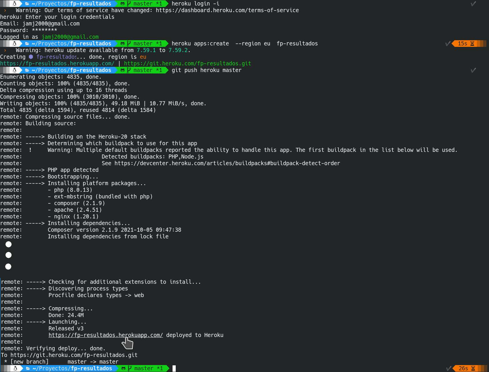

# FP Resultados


## Repositorios relacionados
- [App para android](https://github.com/jamj2000/fp-resultados.apk)
- [Capturas](https://github.com/jamj2000/fp-resultados.capturas)


## Introducción
__fp-resultados__ es una aplicación web destinada al profesorado de Formación Profesional en España. Realizada en mi tiempo libre para seguir aprendiendo sobre distintas tecnologías web. La pongo a disposición de toda la comunidad por si alguien la considera interesante por motivos didácticos o de producción.


Existe una aplicación funcional alojada en [heroku.com](http://fp-resultados.herokuapp.com) para fines demostrativos. La primera vez que se accede a ella suele tardar algún tiempo en cargar. Si esto ocurre volver a intentar de nuevo. 


La aplicación es funcional y dispone de numerosas características.


### Características
- Permite calificar por resultados de aprendizaje.
- Genera actas de evaluación y boletines de calificaciones en HTML y PDF. (Informes PDF aún no terminado)
- Se ha diseñado pensando en los ciclos formativos de la familia profesional de Informática y Comunicaciones, sin embargo es posible adaptarla a otras familias profesionales.
- Permite las operaciones CRUD (Create, Read, Update, Delete) a base de datos MySQL a través de interfaz web.


### Probar la aplicación de demostración
Si deseas comprobar las funcionalidades que ofrece esta aplicación, abre en el navegador la dirección [http://fp-resultados.herokuapp.com](http://fp-resultados.herokuapp.com).

Para entrar debes introducir un correo y contraseña.
Puedes utilizar cualquiera de los siguientes (correos ficticios):

```
email                  contraseña  
=================================
profe1@gmail.com       profe1
profe2@gmail.com       profe2
profe3@gmail.com       profe3
profe4@gmail.com       profe4
profe5@gmail.com       profe5
profe6@gmail.com       profe6
profe7@gmail.com       profe7
profe8@gmail.com       profe8
profe9@gmail.com       profe9
```
Cada proferor puede calificar los resultados de aprendizaje de los módulos que imparte.
Algunos de ellos son tutores de algún curso, otros no. Los que son tutores pueden ver y generar los boletines de notas de su tutoría. Existe un administrador (yo, con correo real jamj2000@gmail.com) que puede ver y generar las actas de evaluación así como realizar diversas tareas administrativas.

Si deseas comprobar las posibilidades para el/los usuarios administradores deberás instalarte la aplicación en tu equipo local y probarla ahí.


## Despliegue en Docker

También puedes desplegar la aplicación con Docker. Existe una imagen para la aplicación web y otra para la base de datos.

Para descargar las imágenes y lanzar los contenedores, ejecuta:


```shell
# Descargamos código fuente de la aplicación
git  clone  https://github.com/jamj2000/fp-resultados.git

# Entramos en carpeta de código fuente
cd fp-resultados

# Lanzamos contenedores
docker-compose  up  -d

# Insertamos datos en el contenedor asociado a la Base de Datos
docker  exec  -it  fpresultados_db_1  /data/database.sh
```


Para ejecutar la aplicación, abre con el navegador la URL [localhost:8888](http://localhost:8888).

El contenedor de MariaDB lleva asociado un **volumen** para guardar la información de la BD y ofrecer persistencia de datos entre distintas ejecuciones. 

En cualquier momento podemos realizar una copia de seguridad del volumen con el contenido de la BD, con el comando:

**Exportar volumen fp-resultados_datos** 


```bash
docker run --rm \
  -v fp-resultados_datos:/source:ro \
  busybox tar -czC /source . > fp-resultados_datos.tar.gz
```

Y obtendremos una copia de seguridad del volumen en el archivo `fp-resultados_datos.tar.gz`.

Para restaurar la copia de seguridad anterior de dicho volumen ejecutamos el siguiente comando:

**Importar volumen fp-resultados_datos**

```bash
docker run --rm -i \
  -v fp-resultados_datos:/target \
  busybox tar -xzC /target < fp-resultados_datos.tar.gz
```

> NOTA: 
>Antes de restaurar la copia de seguridad deberemos asegurarnos de que la aplicación está detenida y el volumen no existe. Esto puede hacerse con los comandos:
>
> ```bash
> docker-compose  down
> docker  volume  rm  fp-resultados_datos
> ```
> Después restauramos el volumen según se indica más arriba y por último iniciamos la aplicación con `docker-compose up -d`.


## Despliegue en Heroku + GearHost

Actualmente la aplicación está desplegada en [HEROKU](https://www.heroku.com). Como base de datos utiliza DBaaS MySQL proporcionado por [GEARHOST](https://gearhost.com).

Si deseas hacer un despligue usando los servicios proporcionados por los sitios anteriores, **sigue estos pasos**: 

1. Crea una cuenta en Heroku. Éste tiene varios [planes](https://www.heroku.com/pricing). Registrate en el plan Free, que aunque está algo limitado es gratis.

2. Instala la herramienta `heroku-cli`. En [este enlace](https://devcenter.heroku.com/articles/heroku-cli) tienes la información necesaria.

3. Clona este repositorio en tu equipo:
  ```bash
  git  clone  https://github.com/jamj2000/fp-resultados.git
  cd   fp-resultados
  ```

4. Inicia sesión desde el terminal en la cuenta que previamente creaste en Heroku. Y crea una nueva aplicación. Lo haremos desde CLI (Command Line Interface).
  
  Para iniciar sesión en Heroku 
  ```bash
  heroku login  -i
  ```
 
  Para crear una aplicación:
  ```bash
  heroku apps:create  --region eu  nombre_aplicacion
  ```
  
  Podemos ver las aplicaciones creadas con:
  ```bash
  heroku apps
  ```

  > NOTA: Si deseamos eliminar una aplicación, podemos hacerlo con:
  > ```bash
  > heroku apps:destroy  nombre_aplicacion --confirm nombre_aplicacion
  > ```

  Comprobamos que tenemos asociado el repositorio Git remoto de Heroku:
  ```bash
  git remote -v
  ```

  Si no es así, añadimos el repositorio git que proporciona Heroku.
  ```bash
  git  remote  add  heroku  https://git.heroku.com/nombre_aplicacion.git
  ```
  
  **NOTA:** Debes sustituir `nombre_aplicacion` por el nombre que desees dar a tu aplicación. Ten en cuenta que no puede tener espacios en blanco ni tildes. Probablemente tengas que probar con varios nombres, pues muchos de ellos ya están ocupados. La opción `--region eu` es para que la aplicación se aloje en servidores de Europa. 
  
5. Despliega el código en Heroku.
  
  ```bash
  git  push  heroku  master
  ```

  Dentro de unos instantes podrás acceder a la aplicación en la url `http://nombre_aplicacion.herokuapp.com`. 
  
  **NOTA:** Debes sustituir `nombre_aplicacion` por el nombre de tu aplicación.
  
  Puedes verla abriendo dicha url en el navegador o ejecutando
  
  ```bash
  heroku  open
  ```




6. ¿Y los datos?
  
  Los datos de la aplicación se guardan en una base de datos. En este caso hemos usado el DBaaS que nos proporciona [GearHost](https://www.gearhost.com). Este sitio tiene varios [planes](https://www.gearhost.com/pricing). Escoge el plan Free, que aunque está algo limitado es gratis. 

7. Crea una base de datos MySQL y apunta los parámetros de configuración.
  
  En concreto deberás anotar 5 datos:
  - El nombre o IP de host donde se aloja la base de datos.
  - El puerto.
  - El nombre de la base de datos.
  - El nombre del usuario.
  - La contraseña de dicho usuario.
  
  

8. Crea las tablas e introduce los datos en ellas. Para ello sigue estos pasos:

  - Entra en el directorio data del repositorio, que contiene los datos y el script `database.sh` a ejecutar.

  ```bash
  cd  data
  ```
  - Edita el script `database.sh` con la información de tu base de datos.
  
  
  
  - Ejecuta el script `database.sh`
 
  
  
  - Comprueba que el resultado es correcto.
  
  ```bash
  mysql -h database_host -D database_name -u database_user -pdatabase_password
  ```
  **NOTA**: Sustituye *database_host*,  *database_name*,  *database_user* y *database_password* por los valores que aparecen en tu configuración de GearHost.
  
  
   

9. Asegúrate que el archivo `config/database.php` contiene, entre otras, la siguiente configuración:

  ```php

    'default' => env('DB_CONNECTION', 'mysql'),

    // ...

        'mysql' => [
            'driver' => 'mysql',
            'url' => env('DATABASE_URL'),
            'host' => env('DB_HOST', '127.0.0.1'),
            'port' => env('DB_PORT', '3306'),
            'database' => env('DB_DATABASE', 'forge'),
            'username' => env('DB_USERNAME', 'forge'),
            'password' => env('DB_PASSWORD', ''),
            'unix_socket' => env('DB_SOCKET', ''),
            'charset' => 'utf8mb4',
  ```
  Ésta es la configuración para la base de datos usada en producción.
  
  > NOTA: La configuración de la base de datos usada en desarrollo (entorno local) está configurada en el archivo `app/config/local/database.php`.
  
  En el paso siguiente vamos a configurar las **variables de entorno** necesarias para la conexión a la base de datos.
  

10. Configura las **variables de entorno** (llamadas config var en Heroku).

Para ello puedes usar uno de los siguientes métodos:
- Interfaz de Línea de Comandos (CLI) 
- Interfaz Web

**CLI**

Debemos asignar valores a las 6 variables siguientes: `DB_HOST`, `DB_PORT`, `DB_DATABASE`, `DB_USERNAME`, `DB_PASSWORD` y `PRODUCTION`.

Por ejemplo:

```bash
heroku config:set DB_HOST=den...gear.host
heroku config:set DB_PORT=3306
heroku config:set DB_DATABASE=basedatos
heroku config:set DB_USERNAME=usuario
heroku config:set DB_PASSWORD=clave
heroku config:set PRODUCTION=true
```

Para ver las variables configuradas, ejecutamos:

```bash
heroku config
```


> NOTA: Si deseamos eliminar una variable, lo hacemos con
>
> ```bash
> heroku config:unset NOMBRE_VARIABLE
> ```


**Interfaz Web**

Si configurar las variables de entorno mediante CLI no te llama la atención, siempre puedes hacerlo mediante intefaz Web. 

Para ello, vuelve a la web de Heroku, inicia sesión, selecciona tu aplicación y pincha en el apartado `Settings` y luego en el botón `Reveal Config Vars`. Crea las variables de entorno que se muestran a continuación con los datos que recopilaste en el apartado anterior. Después pulsa en el boton `More` y luego en `Restart all dynos`, en la parte superior derecha de la página.

  
  
  Ponemos la variable de entorno **`PRODUCTION`** a `true`. El archivo `bootstrap/start.php` busca esta variable. 
  Si existe lanza la aplicación en modo producción y utiliza la base de datos remota. 
  Si no existe lanza la aplicación en modo local y usa la base de datos local.

13. Abre el navegador web y ve a la URL de la aplicación. En mi caso `http://fp-resultados.herokuapp.com`.

  Debe aparecer lo siguiente:
  

  Si inicias sesión con usuario `profe9@gmail.com` y contraseña `profe9`:  
  
  


# Licencia

* [GPL-3](http://www.gnu.org/licenses/gpl-3.0.html) / <https://github.com/jamj2000/fp-resultados>
* [CC BY-SA 4.0](https://creativecommons.org/licenses/by-sa/4.0/) / <https://github.com/alecive/FlatWoken>

```
- Código            GPL-3         José Antonio Muñoz Jiménez
- Iconos FlatWoken  CC BY-SA 4.0  Alessandro Roncone         
```

